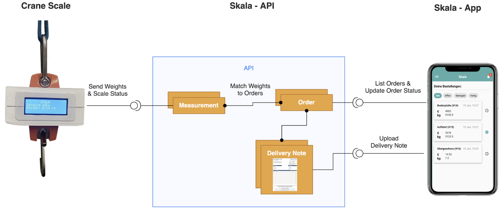
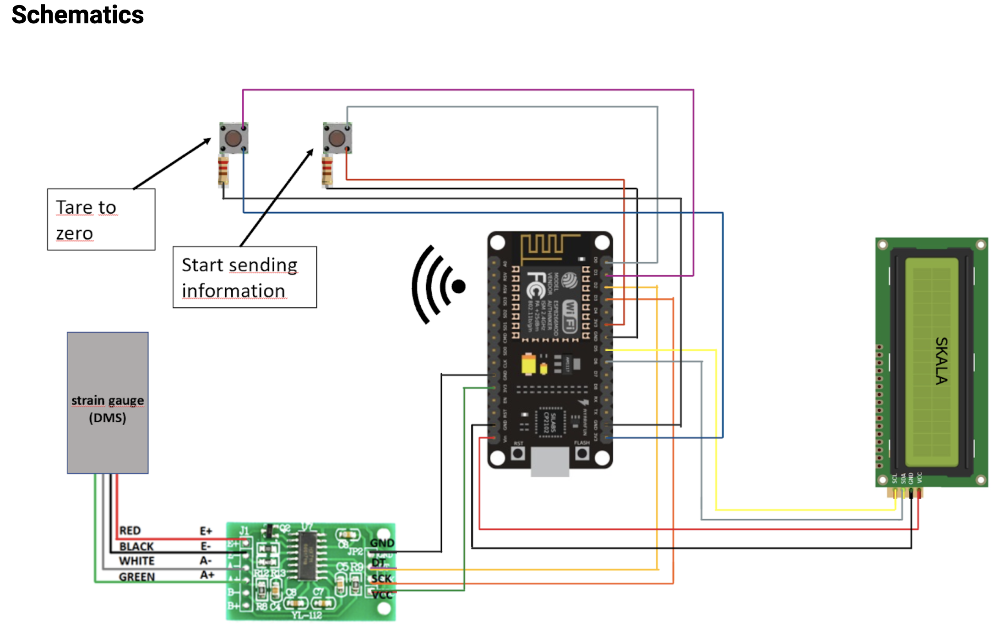
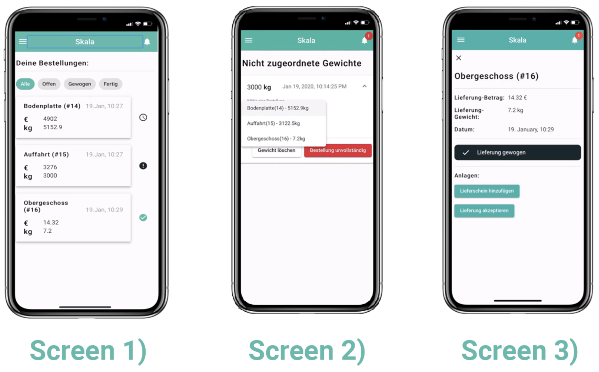

  
  
## Intro
We weigh rebar deliveries on construction sites and match them with the order lists of the construction company.

This repository includes the mobile application, the backend as well as the code for our scale.

The <a href="https://github.com/tpfeifle/skala/blob/master/TechnicalProjectDescription_Skala.pdf">following tutorial</a> will guide you step-by-step through our solution.

## Overview

Construction site managers get truck deliveries of rebar, which often miss rebar. As the deliveries contain countless (often more than 1000) pieces of rebar they can not count them and have to assume that the deliveries are complete.
Our solution weighs the rebar positions by attaching a scale to the crane that is used for the unloading of the trucks. The measured weights are then matched with the order lists. The resulting status (complete/incomplete) for the orders is displayed in a mobile application on mobile and desktop devices.

Our solution consists of the three components seen below:

1. A scale that we attach to the crane`s hook
2. An API that stores the measurements, orders and delivery notes
3. A mobile/web application that displays the orders and allows to update their status



## Hardware Setup

Following is a schematic of our setup. For a detailed description of the components used please see
<a href="https://github.com/tpfeifle/skala/blob/master/TechnicalProjectDescription_Skala.pdf">our documentation</a>


## Skala-API

This is the central piece of the Skala platform (see Components Diagram) and exposes REST-endpoints for the CRUD(Create, Read, Update, Delete)-operations on the orders, delivery notes and measurements. It also maps the stream of measured weights to their respective orders.
Dependency-Setup
We use the asynchronous event driven JavaScript runtime Node.js. This makes it easy to build scalable network applications. Specifically we use the framework Nest.js which provides many features to help structure the application and to provide HTTP utilities and middlewares. To run the API first install the following dependencies:

- Install nodejs (https://nodejs.org/en/download/)
  e.g.  
  `$ brew install node`
- Install Nestjs  
  `$ npm install -g @nestjs/cli.`

For data storage we use a simple SQL database. In this demo setup we use a Docker-instance:
Install docker desktop (https://docs.docker.com/install/)
Run the mysql docker instance on port 3306, create a database “techchallenge” and set your root-password

`$ docker run -p 3306:3306 --name some-mysql -e MYSQL_ROOT_PASSWORD=CHOOSE_YOUR_PASSWORD -e MYSQL_DATABASE=techchallenge -d mysql:5.7`

On top of the SQL database we use the object relation mapper (ORM) TypeORM. It stores each entity in a file, specifying e.g. relations simply by annotations. It is automatically installed with the Node-Package-Manger (NPM) once you build the application
Skala-API-Setup
After installing the dependencies and setting up the database we can now build the Skala-API.
The source-code is available on Github (https://github.com/tpfeifle/skala/backend).
Follow these steps to get it running on your machine:

```
$ git clone https://github.com/tpfeifle/skala
$ cd skala/backend
$ export DB_TECHCHALLENGE_PASSWORD=”CHOOSE_YOUR_PASSWORD”
$ npm install
$ nest start
```

After those steps the REST-API will be available on your machine on port 3000
Check this by opening http://localhost:3000 in your browser. You should be greeted with the following screen:

To see which endpoints are now available open http://localhost:3000/api.
Now you have setup all the backend that you require for this project. Next we will show how to compile and serve the application.

## Mobile-/Web-Application

Our application is built with the framework Angular, which brings many useful features for interactive applications as client side routing, dependency injection and data bindings.
This part requires that you have already installed the API as described above.
The source-code is available in the same Github repository in the folder app (https://github.com/tpfeifle/skala/app). Just navigate to the folder app

Steps:

```
$ cd skala/app
$ npm install -g @angular/cli # Install Angular
$ npm install # Install the dependencies
```

Build the application and serve it locally on port 4200  
`$ ng serve --host=0.0.0.0`  
After running those steps the application will be available on your machine on port 4200
Check this by opening http://localhost:4200 in your browser. You should be greeted with a screen similar to the screen 1) below.
The orders can be created with the REST-API to match the content seen above
While you can use the app on a desktop device, you can also open this page on mobile devices and will see the mobile optimized views there.


